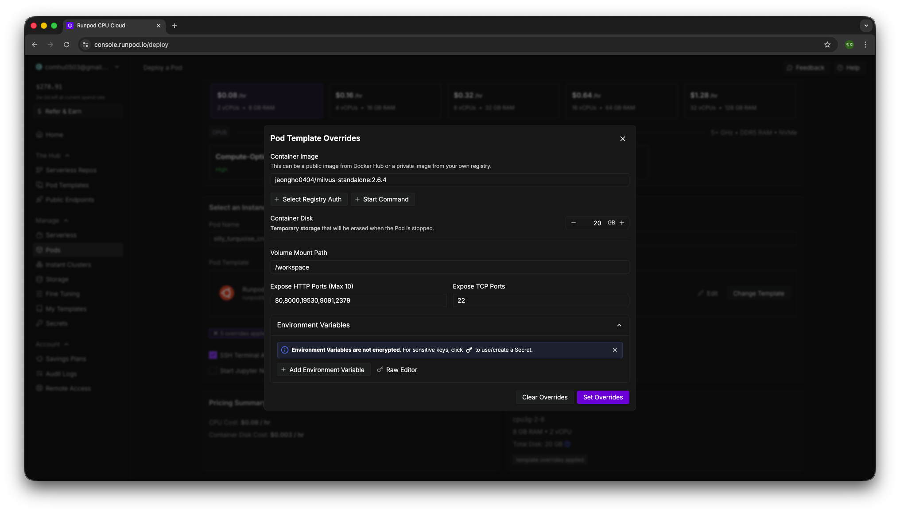

# milvus-standalone-runpod

RunPod 환경에서 Milvus Standalone을 실행하기 위한 커스텀 Docker 이미지 및 설정 모음입니다.  
공식 `standalone_embed.sh` 스크립트가 수행하는 작업을 Dockerfile과 엔트리포인트 스크립트로 옮겨, RunPod의 제한된 설정(이미지, 시작 커맨드, 포트, 환경변수) 안에서도 Milvus를 구동할 수 있도록 구성했습니다.

---

## 목차

* [배경](#배경)
* [구성 요소](#구성-요소)
* [동작 원리](#동작-원리)
* [사전 요구사항](#사전-요구사항)
* [빌드 및 푸시](#빌드-및-푸시)
* [로컬에서 테스트 실행](#로컬에서-테스트-실행)
* [RunPod에서 사용 방법](#runpod에서-사용-방법)
  * [1. 템플릿 생성 시 설정](#1-템플릿-생성-시-설정)
  * [2. 포트 설정](#2-포트-설정)
  * [3. 환경변수 설정](#3-환경변수-설정)
* [파일 구조](#파일-구조)
* [환경변수 상세](#환경변수-상세)
* [포트 설명](#포트-설명)
* [주의사항](#주의사항)
* [트러블슈팅](#트러블슈팅)

---

## 배경

Milvus 공식 문서에서는 Standalone 설치를 위해 `standalone_embed.sh` 스크립트를 제공하며, 내부적으로 다음과 같이 `docker run` 명령을 실행합니다.

* `--security-opt`, `--health-*`, `-v` (볼륨 마운트), `-p` 등 다양한 Docker 옵션 사용
* embedEtcd 설정 파일(`embedEtcd.yaml`) 및 사용자 설정 파일(`user.yaml`)을 로컬 디렉토리에 생성
* 컨테이너가 healthy 상태가 될 때까지 대기

그러나 RunPod의 Pod 템플릿에서는 다음 항목만 직접 설정할 수 있습니다.

* Container Image
* Container Start Command
* Expose HTTP Ports
* 환경변수

즉, `docker run` 옵션 대부분을 사용할 수 없기 때문에, Milvus Standalone을 그대로 실행하기 어렵습니다.  
이 레포지토리는 이러한 제약을 우회하기 위해, 필요한 설정을 **Docker 이미지 자체에 포함**하는 것을 목표로 합니다.

---

## 구성 요소

이 레포지토리는 기본적으로 다음 두 파일을 포함합니다.

* `Dockerfile`
  * `milvusdb/milvus:v2.6.4` 이미지를 베이스로 사용
  * Milvus 설정 디렉토리 및 데이터 디렉토리 생성
  * 기본 환경변수 정의
  * `HEALTHCHECK` 정의
  * `entrypoint.sh` 를 컨테이너의 엔트리포인트로 지정

* `entrypoint.sh`
  * 컨테이너 시작 시 `embedEtcd.yaml`, `user.yaml` 파일을 컨테이너 내부에 자동 생성
  * 마지막에 `milvus run standalone` 명령으로 Milvus Standalone 서버 실행

---

## 동작 원리

1. 컨테이너가 시작되면 `entrypoint.sh`가 실행된다.
2. `/milvus/configs/embedEtcd.yaml` 파일이 없으면 기본 내용으로 생성한다.
3. `/milvus/configs/user.yaml` 파일이 없으면 기본 내용으로 생성한다.
4. 환경변수(ETCD 관련, DEPLOY_MODE 등)를 읽고 Milvus 실행 환경을 구성한다.
5. `milvus run standalone` 을 실행하여 Milvus Standalone 서버를 시작한다.
6. Dockerfile에 정의된 `HEALTHCHECK` 가 `http://localhost:9091/healthz` 를 주기적으로 호출하여 상태를 확인한다.

RunPod에서는 별도의 시작 커맨드를 지정하지 않더라도, 위 과정이 자동으로 수행된다.

---

## 사전 요구사항

* Docker가 설치된 로컬 환경
* Docker Hub, GHCR 등 이미지 레지스트리 계정
* RunPod 계정 및 Pod 템플릿 생성 권한
* (Apple Silicon Mac 처럼 `arm64` 환경에서 RunPod(`linux/amd64`)를 사용할 경우) `docker buildx` 사용 가능해야 함

---

## 빌드 및 푸시

### 1. 레포지토리 클론

```bash
git clone https://github.com/Je0ngh0/milvus-runpod-standalone.git
cd milvus-runpod-standalone
```

### 2. 레지스트리에 올릴 이미지 이름 결정

아래 형식으로 사용할 것을 권장합니다.

```text
<dockerhub_username>/milvus-standalone:2.6.4
```

예시:

```text
jeongho0404/milvus-standalone:2.6.4
```

### 3. 멀티 아키텍처 빌드 및 푸시 (권장, 특히 Mac/arm64 환경)

RunPod는 `linux/amd64`를 사용하므로, Apple Silicon Mac 등에서 이미지를 빌드하는 경우 `buildx`를 이용하여 `linux/amd64`용 이미지를 만들어야 합니다. (원하면 `linux/arm64`도 함께 생성)

#### buildx 빌더 생성 (최초 1회만)

```bash
docker buildx create --use
```

#### 멀티 플랫폼 빌드 + 푸시

```bash
docker buildx build \
  --platform linux/amd64,linux/arm64 \
  -t <dockerhub_username>/milvus-standalone:2.6.4 \
  --push .
```

예시:

```bash
docker buildx build \
  --platform linux/amd64,linux/arm64 \
  -t jeongho0404/milvus-standalone:2.6.4 \
  --push .
```

### 4. (옵션) 단일 아키텍처 빌드

이미 `linux/amd64` 환경(예: 일반 리눅스 서버)에서 빌드하는 경우에는 일반 `docker build`를 사용해도 됩니다.

```bash
docker build -t <dockerhub_username>/milvus-standalone:2.6.4 .
docker push <dockerhub_username>/milvus-standalone:2.6.4
```

---

## 로컬에서 테스트 실행

RunPod에 올리기 전에 로컬에서 미리 실행을 검증할 수 있습니다.

```bash
docker run -d --name milvus-standalone \
  -p 19530:19530 \
  -p 9091:9091 \
  -p 2379:2379 \
  <dockerhub_username>/milvus-standalone:2.6.4
```

로그 확인:

```bash
docker logs -f milvus-standalone
```

Health 상태 확인:

```bash
docker inspect --format='{{json .State.Health}}' milvus-standalone | jq
```

---

## RunPod에서 사용 방법

### 1. 템플릿 생성 시 설정

RunPod에서 새 Pod 템플릿을 만들 때 다음과 같이 설정합니다.

* **Container Image**

  * `<dockerhub_username>/milvus-standalone:2.6.4`
    예: `jeongho0404/milvus-standalone:2.6.4`

* **Container Start Command**

  * **비워둠**
  * Dockerfile의 `ENTRYPOINT ["/entrypoint.sh"]` 가 내부에서 `milvus run standalone` 을 실행하므로, 별도의 시작 커맨드를 지정할 필요가 없습니다.



### 2. 포트 설정

**Expose HTTP Ports (Max 10)** 항목에 다음 포트를 등록합니다.

* `19530`
* `9091`
* `2379`

> RunPod UI에서는 이름이 “HTTP Ports”이지만, gRPC 포트(19530)도 여기서 함께 노출해야 외부에서 접근할 수 있습니다.

실제 사용 목적은 아래 [포트 설명](#포트-설명)을 참조하세요.

### 3. 환경변수 설정

Dockerfile에서 기본값을 지정해 두었기 때문에, RunPod 템플릿에서 환경변수를 별도로 설정하지 않아도 동작합니다.
필요시 다음과 같이 RunPod UI에서 환경변수를 다시 지정하여 기본값을 덮어쓸 수 있습니다.

예시:

* `ETCD_USE_EMBED=true`
* `ETCD_DATA_DIR=/var/lib/milvus/etcd`
* `ETCD_CONFIG_PATH=/milvus/configs/embedEtcd.yaml`
* `COMMON_STORAGETYPE=local`
* `DEPLOY_MODE=STANDALONE`

---

## 파일 구조

예상되는 레포지토리 구조는 다음과 같습니다.

```text
milvus-runpod-standalone/
├─ Dockerfile
├─ entrypoint.sh
└─ README.md
```

각 파일의 역할은 다음과 같습니다.

| 파일명             | 설명                                  |
| --------------- | ----------------------------------- |
| `Dockerfile`    | Milvus 기반 RunPod 전용 Docker 이미지 정의   |
| `entrypoint.sh` | 컨테이너 시작 시 설정 파일 생성 및 Milvus 실행 스크립트 |
| `README.md`     | 사용법 및 설정 방법 문서                      |

---

## 환경변수 상세

| 환경변수                 | 기본값                              | 설명                                               |
| -------------------- | -------------------------------- | ------------------------------------------------ |
| `ETCD_USE_EMBED`     | `true`                           | Embedded Etcd 사용 여부                              |
| `ETCD_DATA_DIR`      | `/var/lib/milvus/etcd`           | Etcd 데이터 디렉토리                                    |
| `ETCD_CONFIG_PATH`   | `/milvus/configs/embedEtcd.yaml` | embedEtcd 설정 파일 경로                               |
| `COMMON_STORAGETYPE` | `local`                          | Milvus 스토리지 타입                                   |
| `DEPLOY_MODE`        | `STANDALONE`                     | Milvus 배포 모드 (Standalone / Cluster 중 Standalone) |

RunPod에서 동일한 이름의 환경변수를 지정하면 Dockerfile의 기본값을 덮어씁니다.

---

## 포트 설명

Milvus Standalone 및 Embedded Etcd는 다음 포트를 사용합니다.

| 포트  | 설명                                                                                       |
|-------|--------------------------------------------------------------------------------------------|
| 19530 | Milvus gRPC 포트입니다. Python / Java / Go / Node.js 등의 SDK는 기본적으로 이 포트로 접속합니다.<br>로컬 기본 주소는 `http://localhost:19530` 이며, RunPod에서는 `<runpod-host>:19530` 형식으로 사용합니다. |
| 9091  | Milvus의 **관리/모니터링용 HTTP 포트**입니다. `healthz` 엔드포인트와 WebUI가 이 포트에서 제공됩니다.<br>예: 로컬 환경에서는 `http://127.0.0.1:9091/webui/` 로 WebUI에 접근할 수 있고, `http://127.0.0.1:9091/healthz` 로 상태를 확인할 수 있습니다. |
| 2379  | Embedded Etcd 클라이언트 포트입니다. Milvus와 동일 컨테이너 내에 embed Etcd가 설치되어 이 포트에서 서비스되며, 설정은 `embedEtcd.yaml` 에 의해 제어됩니다. |

RunPod의 **Expose HTTP Ports** 에 위 세 포트(19530, 9091, 2379)를 모두 추가해 두면,  
RunPod가 제공하는 도메인/엔드포인트를 통해 다음과 같이 접근할 수 있습니다.

- SDK(gRPC): `<runpod-host>:19530`
- WebUI: `http://<runpod-host>:9091/webui/`
- health 체크(필요 시): `http://<runpod-host>:9091/healthz`
- Etcd(디버깅/점검 용도): `<runpod-host>:2379`


---

## 주의사항

1. **데이터 영속성**

   * 이 Dockerfile 예시에서는 컨테이너 내부 디렉토리(`/var/lib/milvus`)에 데이터를 저장합니다.
   * RunPod에서 영속 스토리지가 필요하다면 RunPod의 Volume 기능과 연계하여 이 경로를 마운트하는 구성이 별도로 필요합니다.
   * 볼륨을 마운트하지 않으면 Pod 재생성 시 인덱스/데이터가 모두 초기화됩니다.

2. **보안 옵션**

   * 공식 스크립트에서는 `--security-opt seccomp:unconfined` 옵션을 사용하지만, RunPod에서는 동일한 방식으로 seccomp 설정을 직접 제어할 수 없습니다.
   * 이 레포지토리는 기본 seccomp 환경에서도 동작하는 구성을 목표로 합니다.

3. **Healthcheck**

   * Dockerfile의 `HEALTHCHECK` 는 `http://localhost:9091/healthz` 를 기준으로 합니다.
   * Milvus가 기동하는 데 시간이 오래 걸리는 환경에서는 초기 상태에서 Healthcheck 실패가 발생할 수 있으며, 해당 경우에는 Docker 레벨의 재시작 정책을 별도로 고려해야 합니다.

4. **아키텍처**

   * RunPod는 기본적으로 `linux/amd64` 환경입니다.
   * Apple Silicon Mac 등 `arm64` 환경에서 이미지를 빌드하는 경우, 반드시 `docker buildx` 와 `--platform linux/amd64` 옵션을 사용하여 RunPod에서 사용할 수 있는 이미지를 만들어야 합니다.

---

## 트러블슈팅

다음은 자주 발생할 수 있는 문제와 점검 포인트입니다.

1. **컨테이너가 바로 종료되는 경우**

   * RunPod 혹은 로컬에서 컨테이너 로그를 확인합니다.

     ```bash
     docker logs -f milvus-standalone
     ```

   * `embedEtcd.yaml` 파싱 오류, 포트 충돌, 권한 문제 등의 메시지가 있는지 확인합니다.

2. **health 상태가 `unhealthy` 인 경우**

   * 9091 포트로 healthz 엔드포인트 접근이 가능한지 확인합니다.

     ```bash
     curl -f http://localhost:9091/healthz
     ```

   * Milvus가 완전히 기동되기 전에 Healthcheck 가 수행되고 있는지, 초기 지연 시간이 필요한지 확인합니다.

3. **RunPod에서 외부 접속이 되지 않는 경우**

   * Expose HTTP Ports에 `19530`, `9091`, `2379`가 모두 설정되어 있는지 확인합니다.
   * Pod 상태가 `Running` 인지, RunPod Dashboard의 로그에서 에러가 없는지 점검합니다.
   * SSH 접속이 가능한 템플릿인 경우, SSH로 접속 후 내부에서 `curl`, `nc` 등을 사용하여 포트가 열려 있는지 추가로 확인할 수 있습니다.

---
